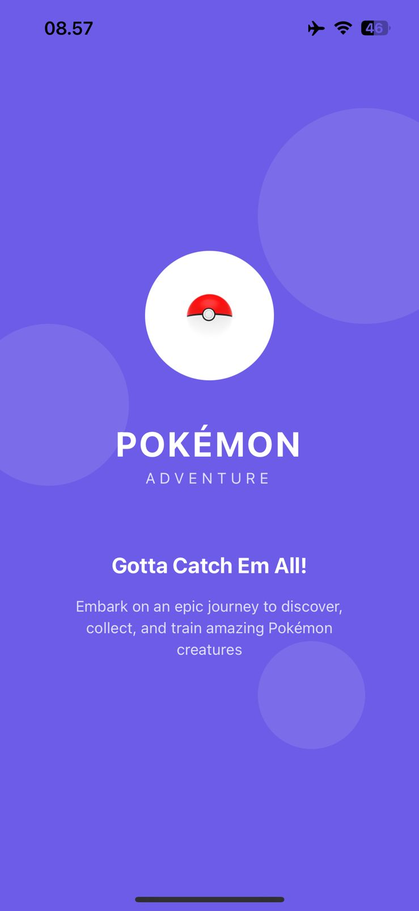
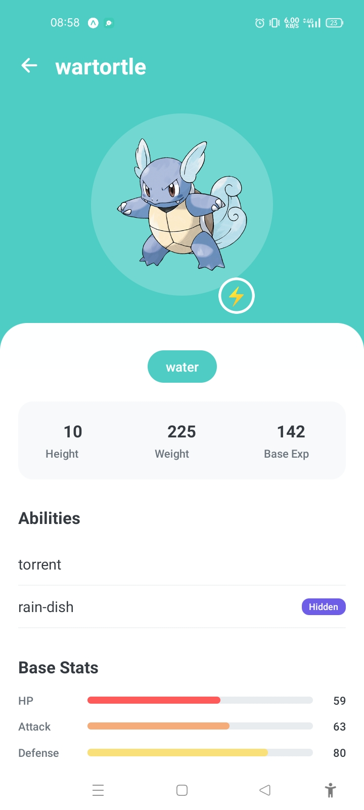
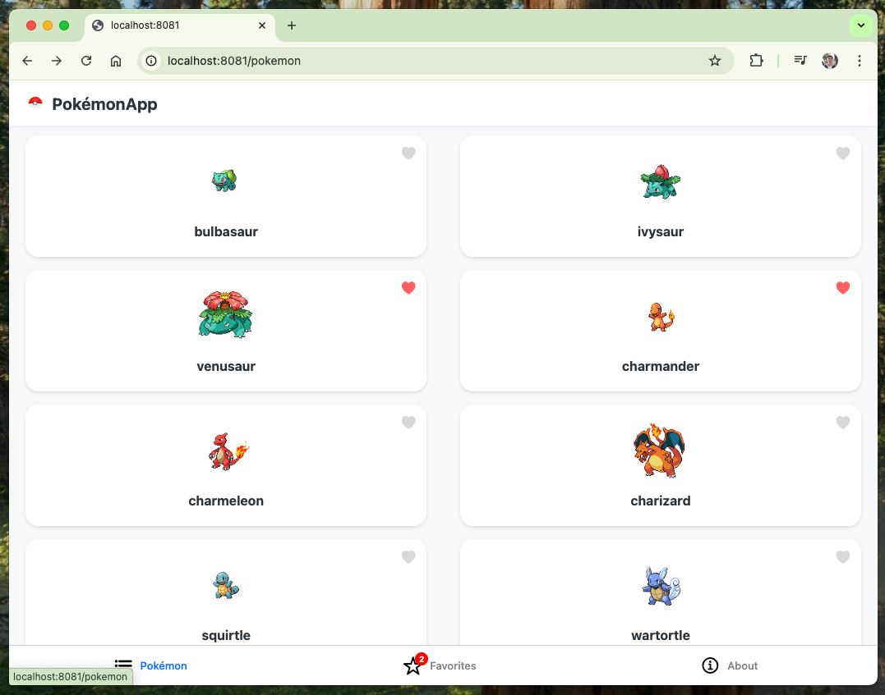

# Pokémon App

A cross-platform Pokémon app built with **Expo**.  
Runs on **Android, iOS, and Web** from a single codebase.

## 📸 Screenshots

### iOS



### Android



### Web



## 🚀 Features

- Browse Pokémon list with infinite scroll
- View detailed Pokémon information
- Add/remove favorites with local persistence
- TypeScript support
- Caching and data fetching with axios & tanstack query
- Unit tests with **Jest**
- Ready for **EAS Build** deployment

---

## 📦 Getting Started

### 1. Clone Repository

```bash
git clone https://github.com/45ruL/pokemon-app.git
cd <your-repo>
```

### 2. Clone Repository

```bash
npm install
# or
yarn install

```

### 3. Env

```bash
cp env.example .env

```

### 4. 📱 Running the App (Expo GO)

Android

```bash
Install and scan via Expo GO
```

iOS

```bash
Install and scan via Expo GO
```

Web

```bash
run on localhost:8081 (or another port)
```

### 5. Running Test

```bash
npm test
# or
yarn test

```

### 5. 📦 Build with EAS (Optional)

Make sure you are logged in to Expo:

```bash
eas login

```

Then build:

```bash
eas build -p android --profile preview
eas build -p ios --profile preview

```

## 🔗 Preview Builds:

Mobile (android) :

```bash
https://expo.dev/accounts/assdev15/projects/assdev15-app/builds/ef432eef-18fd-4819-9646-15caf612e0ac
```

Web :

```bash
https://assdev15-app--op8n2hbmxh.expo.app
```
